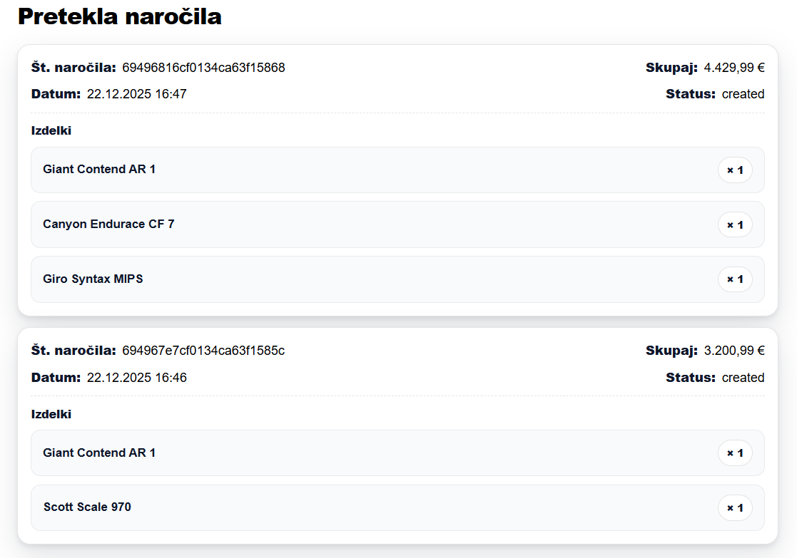

# Športna Trgovina s kolesarsko opremo Bicklstore


Spletna trgovina s kolesarsko opremo, razvita kot akademski projekt. Omogoča prikaz izdelkov, filtriranje, ogled kategorij, registracijo in prijavo uporabnika, večjezičnost ter osnovne podporne funkcije, potrebne za delovanje spletne trgovine. Projekt predstavlja temelje modernega spletnega trgovinskega sistema z ločenim frontendom in backendom.

## Trenutne funkcionalnosti (stanje do 5. cikla)
### Uporabniki
- Registracija in prijava uporabnika (JWT)
- Pridobivanje uporabniških podatkov (profil)
- Modalna okna za prijavo/registracijo
- Frontend funkcionalnost za pozabljeno geslo
  


### Izdelki in kategorije
- Prikaz vseh izdelkov (kolesa, oblačila, oprema)
- Prikaz podrobnosti izdelka
- Prikaz kategorij izdelkov
- Trije filtri za opremo
- Model in factory za produkt
- Seed podatki za izdelke, kategorije in variante
- Backend podpira delo z variantami (zaloga, cena, izračun košarice)
- urejanje seznama izdelkov (paginacija, filtriranje, sortiranje)

### Navigacija in jezik
- Routing med stranmi
- Globalna menjava jezika 
### Informacije in poslovalnice
- Interaktivni zemljevid poslovalnic
- Kontaktna stran in obrazec

### Košarica 
- Definirana struktura košarice (productId, variantId, quantity)
- Izračun vmesne vsote (subtotal)
- Dodan izračun davka (DDV) in dostave
- Preverjanje zaloge na ravni variant
- Podpora za variante izdelkov
- Centralizirana logika izračuna cene (pripravljeno za orders)

## Uporabljene tehnologije 
### Backend
- Node.js + Express
- MongoDB + Mongoose
### Frontend
- Angular
- Komponentna arhitektura
- Services za komunikacijo z API-ji
- Integriran Google Translate Website Widget
## Namestitev in zagon
### Kloniranje repozitorija
```bash
git clone https://github.com/markloborec/Spletna-Trgovina.git
cd Spletna-Trgovina
```

### Backend
**Namestitev odvisnosti**
```bash
cd backend
npm install
```

**Konfiguracija**
- Ustvarite datoteko .env v backend mapi z naslednjo vsebino:
```env
MONGODB_URI=your_mongodb_connection_string
JWT_SECRET=your_jwt_secret_key
PORT=4000
NODE_ENV=development
```

**Zagon strežnika**
```bash
npm run dev
```

### Frontend
   **Namestitev odvisnosti**
```bash
cd sports-store
npm install
```

   **Konfiguracija**
- Uredimo `environment.ts` v `src/environments/`:
```typescript
export const environment = {
  production: false,
  apiUrl: 'http://localhost:4000/api'
};
```

   **Zagon aplikacije**
```bash
cd sports-store
ng serve --open
```

- Frontend: http://localhost:4200
- Backend API: http://localhost:4000/api

## Arhitektura sistema
### Frontend 
- Angular aplikacija s komponentnim pristopom
- Integriran Google Translate Website Widget
- Services za komunikacijo z API-ji
- Modeli in tovarniški vzorci za podatkovne objekte
### Backend 
- Express API v Node.js
- JWT avtentikacija
- Mongoose modeli:
1. Users
2. Products
3. Categories
4. ProductVariants
### Baza podatkov
- MongoDB (lokalno ali preko Atlas)

## Testiranje
Trenutno je vzpostavljeno ročno testiranje API endpointov (Postman) in osnovno preverjanje delovanja frontenda.
Avtomatizirani testi bodo dodani v naslednjih ciklih projekta.

### Razvijalci
- **Matevž Koren** - Full Stack razvoj
- **Mark Loborec** - Dokumentacija, frontend razvoj
- **Naja Miličič** - Backend razvoj
### Kontakt in informacije:
- **Discord**
- **E-mail**: bickilstore@gmail.com
- **Telefonska številka**: +386 041 223 531
  
### Licenca:
Projekt je licenciran pod MIT licenco.

### UVOD ZA UPORABNIKA S SLIKAMI:


**KOLESA:** Zgoraj je stran za nakup kolesa. Opremljena je z veliko filtri za boljšo uporabniško izkušnjo in vsemi podrobnostmi glede tipa kolesa.
Filtri:
- **Velikost obročev**: Omogoča filitrianje po velikosti obroča kolesa. Izbira velikosti obroča je odvisna od velikosti posamenzika in hkrati zaradi udobja v vožnji (Absorbiranje vibracij med vožnjo, oprijem gume...)
- **Okvir**: Omogoča filitrianje po velikosti okvirja kolesa in materiala kolesa (Aluminij, karbon). To je pomembna zaradi velikosti uporabnika, saj je lahko večji okvir bolj udoben/primeren za kupca večje velikosti, hkrati pa lažji okvir iz karbona omogoča bolj udobno izkušnjo.
- **Min. Prestav**: Omogoča filitirnaje po številu prestav. Uporabnik lahko tako najde primerno kolo glede na želje razmerja prestav.
- **Razpoložljivost**: Omogoča filtiranje v trenutno razpoložljiva kolesa na lokacijah BicklStore. Če kolo ni razpoložljivo lahko uporabnik klikne na gumb obvesti me.
- **Sortiraj**: Omogoča vpogled spletne strani po Imenu, ceni...
- **Naraščajoče/Padajoče**: Omogoča pregled spletne strani kot Naraščajoče ( npr. najcenjši izdelki so vidni najprej) in Padajoče (npr. najdražji izdelki so vidni najprej).


**KONTAKT:** Zgoraj je izgled strani za kontakt. Trenutno ima stran osnovne kontakne podatke o podjetju in Google maps mapo, ki kaže vse poslovalnice Biciklstore.


**OBLAČILA:** Tako kot kolesa imajo tudi oblačila svoje filtre in podrobnosti, ki izboljšajo uporabniško izkušnjo in omogočijo lažji in hitrejši nakup.

- **Velikost**: Omogoča filitrianje po velikosti oblačila ((XS, S, M, L, XL, XXL).
- **Material**: Omogoča filtriranje po materialu oblačila (poliester, bombaž...)
- **Spol**: Omogoča filtriranje oblačila glede na spol uporabinka (Moška, Ženska in Unisex oblačila).
- **Barva**: Omogoča filtirnaje po barvi izdelka. Stranka lahko izbere oblačilo svoje barve.
- **Razpoložljivost**: Omogoča filtiranje v trenutno razpoložljiva oblačila na lokacijah BicklStore. Če oblačilo ni razpoložljivo lahko uporabnik klikne na gumb obvesti me.
- **Sortiraj**: Omogoča vpogled spletne strani po Imenu, ceni...
- **Naraščajoče/Padajoče**: Omogoča pregled spletne strani kot Naraščajoče ( npr. najcenjši izdelki so vidni najprej) in Padajoče (npr. najdražji izdelki so vidni najprej).
  
  
**OPREMA:**  Ker naša stran omogoča nakup vseh predmetov povezanih s kolesarjenjem smo naredili še stran za opremo. Opremo je prav tako mogoče filtirati glede na želje kupca.
- **Brand**: Omogoča filtriranje po zaželeni znamki.
- **Material**: Omogoča filtriranje po materialu izdelka (plastika, aluminij, karbon,...) Vpliva na težo, trpežnost in zmogljivost opreme.
- **Združljivost**: Omogoča filtirranje po združljivosti opreme.
- **Razpoložljivost**: Omogoča filtiranje v trenutno razpoložljivo opremo na lokacijah BicklStore. Če oprema ni razpoložljiva lahko uporabnik klikne na gumb obvesti me.
- **Sortiraj**: Omogoča vpogled spletne strani po Imenu, ceni...
- **Naraščajoče/Padajoče**: Omogoča pregled spletne strani kot Naraščajoče ( npr. najcenjši izdelki so vidni najprej) in Padajoče (npr. najdražji izdelki so vidni najprej).

  <div align="center">
  
  
  
  </div>

**REGISTRACIJA:** Preden lahko stranka kupuje preko spleta se mora registrirati. Zaradi varnosti je to nujno.


  <div align="center">
    
  
  
  </div>
  

**PRIJAVA:** Za nakup je potrebna prijava zaradi varnostnih razlogov. Uporabnik mora vnesti svoj spletni naslov ter svoje izbrano geslo. Če je geslo pozabil je možnost nastavitve novega gesla z klikom na gumb "Pozabljeno geslo".


<div align="center">
  


</div>

**KOŠARICA:** Košarica omogoča pregled izdelkov, ki jih stranka hoče kupiti ter njihovo skupno ceno. Izdelek se doda v košarico, ko stranka klikne na gumb "Dodaj v košarico" za določeni izdelek. Ikona košarice se pravk tako posodobi glede na število izdelkov v njej. Ko je stranka prepričana, da je nakupila vse mora klikniti gumb "Odpri košarico" za zaključek nakupa.

<div align="center">


</div>

**ZAKLJUČEK:** Ko je stranka pripravljena kupiti izdelek je kliknila gumb odpri košarico. Ta gumb bo stranko napotil do strani za plačilo, kjer se vidi število in ceno izdelkov, ki jih želijo kupiti. Stranka bo imela možnost plačila glede na opcije, ki jih ponuja spleta stran. Če stranka noče kupiti izdelka lahko posamezno klikne na gumb "X" ali pa lahko zavrže vse izdelke z klikom na gumb "Izprazni Košarico".


<div align="center">
  


</div>

**PROFIL:** Stranka lahko dostopa do svojega profila in spreminja svoje informacije. Lahko je pomembno zaradi dostave (npr. drugačna lokacija ali telefonska številka)...

<div align="center">
  


</div>

**INFORMACIJE IZDELKA:** S tem stranka dostopa do dodatnih informacij glede izdelka.

<div align="center">
  


</div>

**PLAČILO:** Ko stranka zaključi z nakupom je potrebno plačilo. Tukaj se lahko odloči za vse opcije, ki so podane kot možnost plačila.

<div align="center">
  


</div>

**PRETEKLA NAROČILA:** Tukaj lahko stranka pregleda vsa svoja naročila preko Bicilstore.
